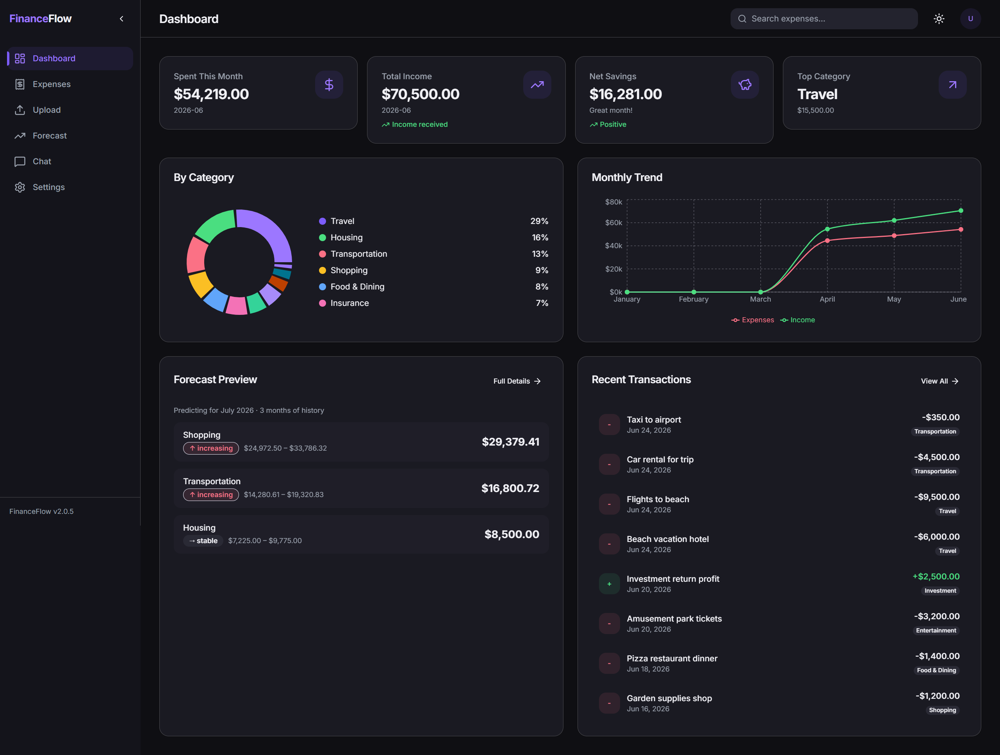

# FinanceFlow

An AI powered personal finance platform. It categorizes your expenses, forecasts next month spending, and lets you chat with your finances in plain language. Built on FastAPI with a React dashboard, a LangGraph and RAG assistant, full test coverage, and Docker.

## Live demo

| App | Link |
|---|---|
| FinanceFlow | https://expense.3-230-42-191.sslip.io |

Open the dashboard to see six months of demo expenses, check the forecast for next month, search transactions (try "Spotify" or "Uber"), and ask the chat questions about your spending.

<p align="center">
  
</p>

## What it does

- **Chat with your finances.** Ask things like "how much did I spend last month?" and get answers grounded in your own data, with sources and conversation memory.
- **Adaptive RAG.** Retrieve, grade, rewrite, answer over fact cards built from real services, so every number matches the API and is never made up.
- **Agents.** A tool calling ReAct agent, a supervisor that routes each question on its own, and a human approval step for any data change.
- **Production RAG.** A persistent vector index with caching, reranking, and per user long term memory.
- **Guardrails.** Input and output checks, plus an evaluation harness (groundedness, retrieval recall, LLM as judge).
- **Solid core.** LLM categorization, per category machine learning forecasting, summaries, a clean layered design, and SQLite or PostgreSQL.

## Tech stack

| Layer | Technology |
|---|---|
| Backend | FastAPI, SQLAlchemy 2.0, Pydantic v2, SQLite or PostgreSQL |
| AI | LangGraph, LangChain, Chroma, Groq or OpenAI or Anthropic |
| Background jobs | Celery and Redis (forecast training, bulk categorization) |
| ML | scikit-learn, pandas, joblib |
| Frontend | React 18, TypeScript, Vite, Tailwind, TanStack Query, Recharts |
| Tooling | Docker and Compose, pytest |

## Run it locally

Backend (Python 3.11):
```bash
python -m venv .venv && source .venv/bin/activate
pip install -r requirements.txt
cp .env.example .env            # set your LLM provider key
uvicorn app.main:app --reload   # http://localhost:8000/docs
```

Frontend:
```bash
cd frontend && npm install && npm run dev
```

Docker (SQLite by default; add `--profile pg` for PostgreSQL):
```bash
docker compose up --build
```

Seed demo data:
```bash
python scripts/seed_data.py --months 6 --url http://localhost:8000 --categorize
```

## The AI assistant

A LangGraph agent answers questions about your own data. The numbers come from the same services behind `/expenses/summary/*` and `/forecast/`, so chat answers always match the API and the model only phrases them. Memory is keyed by `conversation_id`. If the model is unreachable, the agent falls back to a templated, fact grounded answer.

```bash
curl -X POST http://localhost:8000/chat \
  -H "Content-Type: application/json" \
  -d '{"message": "How much did I spend last month?", "conversation_id": "user-42"}'
```

The assistant is provider agnostic. Set the provider, model, and key in `.env`:
```env
CHAT_LLM_PROVIDER=openai        # openai (also Groq via base url), anthropic, gemini
CHAT_LLM_MODEL=gpt-4o-mini
OPENAI_API_KEY=your_key_here
```

## Core API

| Method | Path | Description |
|---|---|---|
| `POST` | `/expenses/upload` | Bulk upload expenses or income (optional auto categorize) |
| `GET` | `/expenses/` | List and search (filters: category, month, search) |
| `GET` | `/expenses/summary/by-category`, `/expenses/summary/monthly` | Summaries |
| `POST` | `/expenses/categorize/run` | LLM categorization |
| `GET` | `/forecast/` | Next month forecast per category |
| `POST` | `/forecast/train`, `/forecast/train/async` | Train the model (sync or background) |
| `POST` | `/chat` | Conversational assistant |

Full interactive docs at `/docs`.

## Background jobs

Celery runs the slow work off the request: forecast model training and bulk LLM categorization. A nightly beat job retrains the model so forecasts stay fresh.

## Deployment

Deployed on AWS with Terraform (shared EC2 host, managed RDS, secrets in SSM, free HTTPS via Caddy and Let's Encrypt). The infrastructure code lives in a separate `infra-deploy` repository.

## Tests

```bash
python -m pytest -q          # fully offline (LLM mocked)
```
